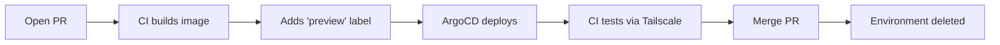

# Preview Demo App

A demo application showcasing ephemeral preview environments with ArgoCD and GitHub Actions.

## How It Works



## Quick Start

1. **Create a branch and make changes**
   ```bash
   git checkout -b feature/my-thing
   # make changes
   git commit -m "My changes"
   git push origin feature/my-thing
   ```

2. **Open a Pull Request** targeting `main`

3. **Wait for CI** (~2-3 min):
   - Builds Docker image
   - Pushes to Docker Hub
   - Adds `preview` label
   - ArgoCD creates environment
   - Tests run automatically

4. **Access your preview**:
   - 🏠 Internal: `https://preview-pr-{N}.shoofio.com`
   - 🔒 Tailscale: `https://preview-pr-{N}.jerboa-hops.ts.net`

5. **Merge or close PR** → Environment auto-deleted

## What Gets Deployed

Each PR gets:
- Dedicated namespace: `preview-pr-{N}`
- Flask app showing build info
- Two ingresses (internal + Tailscale)

## Local Development

```bash
cd app
pip install -r requirements.txt
python main.py
# Visit http://localhost:8080
```

## Environment Variables (baked at build time)

| Variable | Description |
|----------|-------------|
| `COMMIT_SHA` | Full git commit SHA |
| `PR_NUMBER` | Pull request number |
| `BRANCH_NAME` | Branch name |
| `BUILD_TIME` | When image was built |
| `IMAGE_TAG` | Docker image tag |

## CI Workflow

The workflow (`.github/workflows/preview-build.yaml`) does:

1. **Build** - Creates Docker image with build metadata
2. **Deploy** - Adds `preview` label to trigger ArgoCD
3. **Test** - Connects to Tailscale, runs health checks

## Required Secrets

| Secret | Description |
|--------|-------------|
| `DOCKERHUB_USERNAME` | Docker Hub username |
| `DOCKERHUB_TOKEN` | Docker Hub access token |
| `TS_OAUTH_CLIENT_ID` | Tailscale OAuth client ID |
| `TS_OAUTH_SECRET` | Tailscale OAuth secret |

## Troubleshooting

### CI workflow doesn't run
The workflow must exist on `main` branch first. Merge workflow file to main, then PRs will trigger it.

### Tests timeout (000 status)
- Check Tailscale secrets are set
- Verify `tag:ci` ACL exists in Tailscale
- Wait longer — ArgoCD might still be syncing

### Image not found
CI might not have finished. The `preview` label ensures ArgoCD waits for the image.
